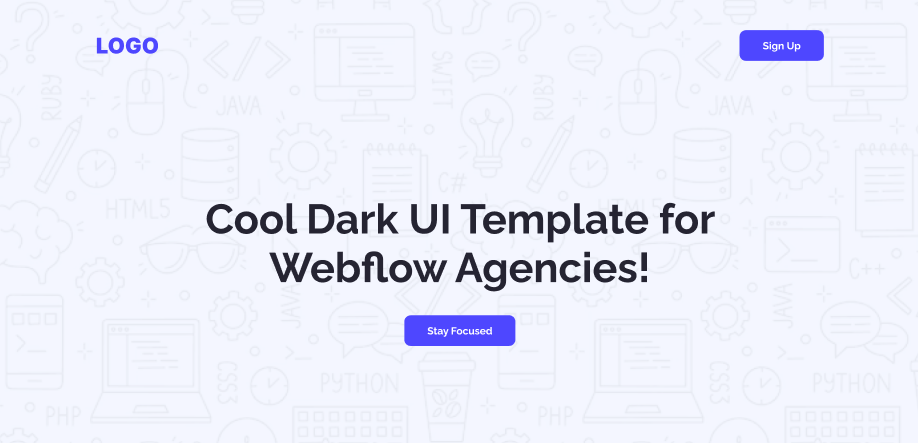

<!-- ## 🌟 WELCOME TO ( সহজ সরল সিম্পল ) ASSIGNMENT-001 😎

### 📅 Deadline For 60 marks: 11th July, 2025 (11:59 pm ⏱️)

### 📅 Deadline For 50 marks: 12th July, 2025 (11:59 pm ⏱️)

### 📅 Deadline For 30 marks:\*\* Any time after 12th July.

---

## ✅ Main Requirements (50 Marks)

### 1. Navbar Section

- **Logo/Website name** on the left.
- **Sign Up Button** on the right.

---

### 2. Banner Section (10 Marks)

- **Heading** in the center. (3)
- **Stay Focused** button in the center. (3)

---

## 🚩 The Navbar and Banner will have an Background Image

### 3. Action Section

- Left Side:
  - Title
  - Subtitle
  - Launch Live Preview Button
- Right Side:
  - Image

---

### 4. Productive Users Section

- **Background color** to separate the section.
- **Centered title**.
- **3 data with subtitle** placed side by side.

---

### 5. Let’s Get In Touch Section (10 Marks)

- Left Side:
  - Section Title
- Right Side:
  - Label + Input for Name, Email & Message
  - Get in Touch Button

---

### 6. Footer Section

- Centered:
  - Website name
  - Subtitle
  - Links: Home, About, How it works, Services

## 

## 🧪 CHALLENGES (10 Marks)

### 7. Users’ Feedback Section

- Star icon
- Title and Subtitle
- Reviewer Image, Name, and Date 

 

---

### 8. Button Animation 

- Hover effect or animation on the all the buttons.

---

## ❓ Common Queries & Answers

> ❓ আমি কি অন্য ইমেজ ব্যবহার করতে পারবো?  
> ✅ হ্যা, যেকোন রিলেভ্যান্ট ইমেজ ব্যবহার করা যাবে।

> ❓ আমি কি এলাইনমেন্ট আলাদা ভাবে করে মনের মতো ডিজাইন করতে পারবো?  
> ❌ না। তোমাকে এলাইনমেন্ট ঠিক রাখতে হবে।

> ❓ আমি কি ডিজাইনে কালার চেঞ্জ করতে পারবো ?  
> ✅ হ্যা , তুমি চাইলে রিলেভ্যান্ট কালার ব্যবহার করতে পারো।

> ❓ আমাকে কি একদম পারফেক্ট মার্জিন প্যাডিং দিয়ে একদম পিক্সেল পারফেক্ট পেজ বানাতে হবে?  
> ❌ না। তুমি ফিগমা দেখে নিজের মতো মার্জিন প্যাডিং ব্যবহার করতে পারো।

---

## ⚙️ Technology Stack

- HTML
- CSS
- ⚠️ **No frameworks or libraries** allowed.

---

## 📌 Rules

- ✅ Minimum **5 meaningful commits** required.
- ❌ No Lorem Ipsum or dummy placeholder text. Use relevant content only.

---

## 🔗 What to Submit

- 📂 **GitHub Repository:**
- 🌐 **Live Link:**

# Let's Code and Achieve your Dream 🎯 -->
